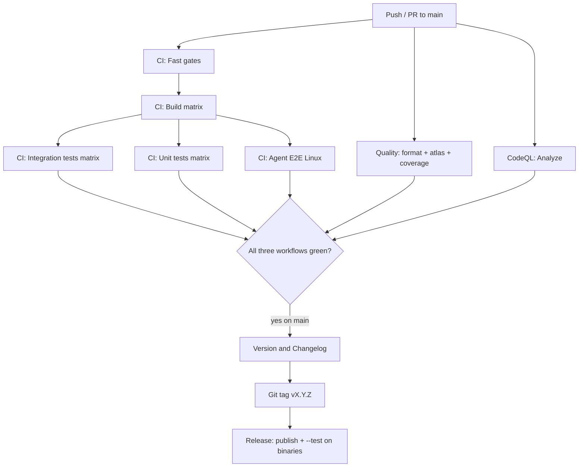

# Release and Mainline Gate Order

How versioning, quality gates, security analysis, and release packaging depend on each other.

## Workflow dependency graph

## Mainline version bump gate

`Version and Changelog` (`.github/workflows/version.yml`) triggers when **CI**, **Quality**, or **CodeQL** completes, but the bump job runs only when:

1. The triggering workflow run concluded with `success`
2. The commit is on `main` or `master`
3. The commit message is not `chore(release): …`
4. **All three** workflows (`ci.yml`, `quality.yml`, `codeql.yml`) have a successful completed run for the same `head_sha`

Partial validation (e.g. CI green but Quality failed) **blocks** version bump and tag creation.

## Release packaging gate

`Release` (`.github/workflows/release.yml`) runs on `v*.*.*` tags (from version bump or manual dispatch).

Each publish matrix job:

1. `dotnet publish` for the target RID
2. **Headless integration** on the published binary: `<Autonocraft|Autonocraft.exe> --test`
3. Zip asset upload to GitHub Releases

Release artifacts are not published without passing `--test` on the built binary.

## Scheduled health runs

| Workflow | Schedule (UTC) | Purpose |
|----------|----------------|---------|
| CI, Quality | Daily 06:00 | Catch mainline regressions outside active PRs |
| CodeQL | Monday 07:00 | Security analysis on main |

Failures appear in GitHub Actions notifications for repository watchers.

## Maintainer exceptions

Required checks must not be disabled to merge without documented approval. See
[`ci-verification-contract.md`](../../specs/003-improve-testing-cicd/contracts/ci-verification-contract.md#exception-process).
